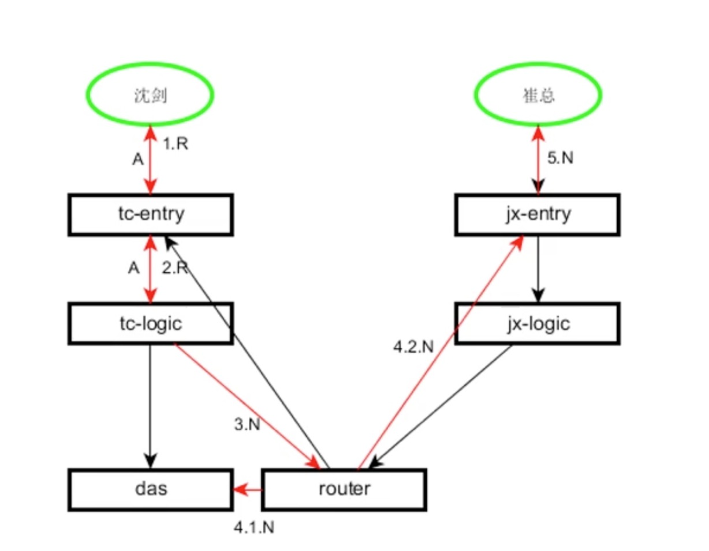
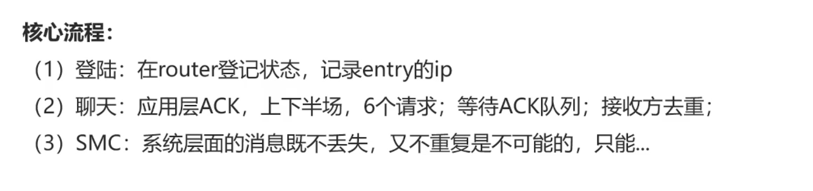

## 什么是即时通讯(Instant Messaging)

大家眼中的即时通讯主要是QQ, 微信，旺旺等。其实远不止这些。

本文说的也主要是聊天、群组这类的即时通讯。

## 协议的设计

(1) 协议(protocol): 两者通信共同时遵守的规则
(2) IM客户端协议: client/server的约定
(3) IM服务器内部协议(RPC): server/server的约定

> 本文说的协议主要是2：客户端到服务端的协议

### 二进制协议

可读性差，安全性高，传输速度快

### 文本协议

MSN 是用的文本协议

性能比较差，需要一行一行的读取，安全性差

### 流式XML

XMPP, Gtalk 使用的是XML协议

### 常见协议栈

传输层协议：TCP
安全层协议：加解密
pb

#### 安全层协议

方案一：使用每个人独有的秘钥来加密

方案二：动态秘钥

#### 应用层协议设计

- 扩展性
- 效率

## 模块

一个IM至少要包含以下模块

- 接入层
- 逻辑层
- 内存存储层(消息路由)
- 存储层

### 接入层

接入层Entry：与客户端保持TCP长连接的模块

主要功能：

- 1、连接整流：将外部大量的长连接转为内部服务少量的短连接
- 2、安全信道：加解密、压缩解压缩、协商秘钥
- 3、初步攻防：连接频率的控制、发包频率的控制、IP/UID黑白名单

### 逻辑层

逻辑层Logic：对上层提供原子性逻辑接口

逻辑接口族：

- 1、登录处理
- 2、用户协议族
- 3、好友协议族
- 4、消息协议族(重点)
- 5、群协议族

### 内存存储

内存存储层router: 本质是一个内存同步数据库

主要功能：

1、存储内存数据(**高可用**)：
  a. 用户**登录之后**才有的属性：登录有的服务端状态（在线，不在线），中转消息，不在线：存离线消息
  b. 用户登录在哪个接入层节点：uid连接在哪个接入层节点
  
> 高可用的关键： 冗余
  
2、转发消息

### 固话存储层

固话存储层das主要功能
1、屏蔽存储引擎
2、对上层提供友好数据访问接口
3、对上层提供部分原子接口
4、统一cache层

## 架构

#### 机房故障容错：分组

不能大量的跨机房连接，只能最小化的跨机房连接。

什么样的请求大概率会跨机房？聊天的请求，消息路由的请求。

其他请求都尽量分组，并且发送在本机房内，比如接入层到逻辑层的请求，逻辑层是无状态的。

#### 水平拆分：hash或者分号段

什么样的服务需要水平拆分？存储服务需要水平拆分增大数据的存储量

> 无状态的服务可以通过节点增加服务的性能

router 存储用户内存的数据

#### 高可用：冗余

高可用的核心方法论：冗余和服务的自动转移。

#### 负载均衡： 平均

每一个模块层次都是负载均衡

## 流程

IM 独有的流程

核心流程
1、登录
2、聊天

#### 登录(重登录)流程

#### 聊天流程

在系统中，每一个报文有三种类型：
请求报文：客户端主动给服务端发起的报文
响应报文：服务端回复用户的请求报文叫响应报文
通知报文：服务端主动给客户端发送的报文

> A: ack
> R: 请求报文
> N: 通知报文

问题：A发送给B的消息，A是如何知道B真的收到消息了呢（也就是A看到了B已经读了这条消息）？

对方告诉A已经，A才真的知道B已经读了。

【你好】消息分为上半场和下半场

上半场(发送方)：
有三个报文：请求、响应(给到发送方)、通知(给到接收方)， 这个响应报文只能表示投递成功，并不代表对方接收成功。

下半场(接收方)：
接收方收到消息以后会发送(系统发送)ack给发送方。其中也有请求包、响应包和通知包。

以上就是消息可达性的6个报文。 

**假设发送方没有收到这条消息呢？**

存在两种情况：分别对应上半场和下半场
这两种差异对于发送方来说的表现都是接收方而言都是消息没有收到。
分别对应两种不同的业务场景：
1、上半场的通知包如果接收方没有收到，是代表接收方真的没有收到这条消息。
2、下半场的回复如果是发送方没有收到，其实是接收方收到了这条消息，但是发送方还不知道

但是对于发送方来说他无法区分这两种情况，他能做的只有重发。

所以这里的一个技术点就是：发送方有一个**ack等待队列**，等待接收方告诉他我收到了这条消息，
如果等待队列里的消息id没有收到应用层的【我收到了】的消息，如果没有收到该消息，发送方会进行重试操作，
按照**指数退避的策略**进行重试。如果超过重试次数，会给用户进行提示，比如微信的：因为网络原因，消息可能没有发送成功。

> 保证了消息不会丢失

**那客户端会不会收到重复的消息呢？**

会的，可以通过接收方对消息(**msg_id**)进行去重，展示上不显示即可。
一定是通过消息id去重，不然【重要的消息要发3遍】的消息就没发发了。

还有一种特殊情况，比如拔网线，路由层是不知道的，但是还是会投到接收方的entry, entry给客户端发送回发送失败。
这是entry需要向 router 发送一条**消息不可达**的消息，以 router 修正接收方的状态为离线，同时将消息固话到数据库里。

## 其他

我们可以保证系统是重复，但是业务层面不重复。

问题

- 好友状态，推送？还是拉取？
- 群友状态，推送？还是拉取？
- 群消息流程，与可达性？
- 系统推送，与可达性？（某条新闻的推送)
- 消息顺序性？可以保证顺序，但是性能比较低
- 群消息，如何保证所有的群友看到的消息是一致的？
- 多端登陆？
- 消息漫游？
- 离线消息的可达性？
- 群离线消息的可达性？

## 总结

